  

---

###

<h1 align="left">Salutations, I'm Syed Irtiza Al</h1>

###

I'm a Computer System Engineering student focused on full-stack web development and software engineering. I build responsive, database-driven web applications using HTML, CSS, JavaScript, PHP, and MySQL, with an emphasis on clean code, user-friendly interfaces, and efficient database design.

I'm continuously improving my backend development skills by building practical projects, exploring modern web development practices, and strengthening my understanding of software development through hands-on experience.

###

## My Tech Stack

###

###

<h1 align="left">🔧 What I'm Working On</h1>

###

###

Something is in progress. It's not ready, so it doesn't have a name yet.  Good things take time to say out loud.

###

<h1 align="left">Fun Fact</h1>

###

###

I have a cat. she has witnessed every deadline. desktop customized. always. it's the first thing. I run @pxlsect.xyz — design, type, setups, digital life  once rebuilt a whole layout because one font felt wrong silence + screen + late hour = best work condition

###

<h1 align="left">📡 Goals / What I'm Learning</h1>

###

There's a direction. A real one.  I don't talk about what I'm learning until I actually know it. Until then heads down, moving forward.  The work will introduce itself.

###

 

